<!--
  Licensed to the Apache Software Foundation (ASF) under one or more
  contributor license agreements.  See the NOTICE file distributed with
  this work for additional information regarding copyright ownership.
  The ASF licenses this file to You under the Apache License, Version 2.0
  (the "License"); you may not use this file except in compliance with
  the License.  You may obtain a copy of the License at
      http://www.apache.org/licenses/LICENSE-2.0
  Unless required by applicable law or agreed to in writing, software
  distributed under the License is distributed on an "AS IS" BASIS,
  WITHOUT WARRANTIES OR CONDITIONS OF ANY KIND, either express or implied.
  See the License for the specific language governing permissions and
  limitations under the License.
-->

# Design Document: NiFi Auto Layout Engine

## Overview

The NiFi Auto Layout Engine is a production-grade Java 21 library that transforms disorganized Apache NiFi flow canvases into clean, readable hierarchical layouts. The library accepts NiFi REST DTOs or Copilot flow maps, constructs a NiFi-independent directed graph, applies a Sugiyama-based hierarchical layout algorithm with NiFi-specific adaptations, resolves collisions, routes connections, and writes computed positions through the selected integration.

### Key Design Decisions

1. **Sugiyama Framework**: Chosen for its well-understood hierarchical layout properties that map naturally to data flow visualization (sources at top, sinks at bottom).
2. **Pipeline Architecture**: Each layout stage is a discrete, replaceable strategy — enabling customization, testing, and incremental improvement.
3. **Adapter Pattern**: NiFi-specific code is isolated behind adapters, making the core algorithms reusable for any directed graph.
4. **Immutable Configuration**: Thread-safe `LayoutOptions` via builder pattern ensures safe concurrent use.
5. **Deterministic by Default**: All internal collections use ordered data structures; all algorithms use stable sorting.

### Data Flow Summary

```
NiFi ProcessGroup (REST DTO or Copilot flow map)
    → NiFi Adapter (parse)
    → Graph Builder (construct directed graph)
    → Component Detector (roots, terminals, disconnected subgraphs)
    → Cycle Detector (Tarjan's SCC, edge reversal)
    → Layer Assigner (longest-path topological assignment)
    → Crossing Minimizer (median/barycenter heuristics)
    → Coordinate Assigner (position computation + grid snap)
    → Collision Resolver (sweep-line detection + displacement)
    → Connection Router (orthogonal/direct routing)
    → Grid Aligner (final snap pass)
    → NiFi Adapter (write-back positions)
    → LayoutResult (updated positions + metadata)
```

## Architecture

### High-Level System Diagram

```mermaid
graph TB
    subgraph Input
        NiFiDTO[NiFi REST DTOs]
    end

    subgraph parser["parser package"]
        RestDtoAdapter[RestDtoAdapter]
    end

    subgraph model["model package"]
        LayoutGraph[LayoutGraph]
        LayoutNode[LayoutNode]
        LayoutEdge[LayoutEdge]
        LayoutOptions[LayoutOptions]
        LayoutResult[LayoutResult]
    end

    subgraph graph["graph package"]
        GraphBuilder[GraphBuilder]
        GraphAnalyzer[GraphAnalyzer]
    end

    subgraph algorithm["algorithm package"]
        CycleDetector[CycleDetector]
        TopologicalSorter[TopologicalSorter]
        ConnectedComponents[ConnectedComponents]
    end

    subgraph layout["layout package"]
        LayerAssigner[LayerAssigner]
        CrossingMinimizer[CrossingMinimizer]
        CoordinateAssigner[CoordinateAssigner]
    end

    subgraph collision["collision package"]
        CollisionDetector[CollisionDetector]
        CollisionResolver[CollisionResolver]
    end

    subgraph router["router package"]
        ConnectionRouter[ConnectionRouter]
        OrthogonalRouter[OrthogonalRouter]
        DirectRouter[DirectRouter]
    end

    subgraph spacing["spacing package"]
        SpacingStrategy[SpacingStrategy]
        DefaultSpacing[DefaultSpacingStrategy]
    end

    subgraph service["service package"]
        LayoutEngine[LayoutEngine]
        LayoutPipeline[LayoutPipeline]
    end

    subgraph writer["writer package"]
        RestDtoWriter[RestDtoWriter]
    end

    NiFiDTO --> RestDtoAdapter
    RestDtoAdapter --> LayoutGraph
    LayoutEngine --> LayoutPipeline
    LayoutPipeline --> GraphBuilder
    LayoutPipeline --> GraphAnalyzer
    LayoutPipeline --> CycleDetector
    LayoutPipeline --> LayerAssigner
    LayoutPipeline --> CrossingMinimizer
    LayoutPipeline --> CoordinateAssigner
    LayoutPipeline --> CollisionResolver
    LayoutPipeline --> ConnectionRouter
    LayoutPipeline --> RestDtoWriter
```



### Package Structure

```
com.nifi.layout/
├── model/           # Domain model (LayoutGraph, LayoutNode, LayoutEdge, LayoutOptions, LayoutResult, enums)
├── graph/           # Graph construction and analysis (GraphBuilder, GraphAnalyzer interfaces + impls)
├── algorithm/       # Generic graph algorithms (CycleDetector, TopologicalSorter, ConnectedComponents)
├── layout/          # Layout algorithms (LayerAssigner, CrossingMinimizer, CoordinateAssigner)
├── parser/          # NiFi-specific REST parsing (RestDtoAdapter) — depends on NiFi DTOs
├── router/          # Connection routing (ConnectionRouter interface, OrthogonalRouter, DirectRouter)
├── spacing/         # Spacing strategies (SpacingStrategy interface, DefaultSpacingStrategy)
├── collision/       # Collision detection and resolution (CollisionDetector, CollisionResolver)
├── service/         # Orchestration (LayoutEngine, LayoutPipeline, PipelineStage)
├── writer/          # Position write-back (RestDtoWriter) — depends on NiFi DTOs
└── util/            # Shared utilities (Geometry, BoundingBox, GridSnapper, Preconditions)
```

### Dependency Rules

```mermaid
graph TD
    parser --> model
    parser --> service
    writer --> model
    writer --> service
    service --> model
    service --> graph
    service --> algorithm
    service --> layout
    service --> router
    service --> spacing
    service --> collision
    graph --> model
    algorithm --> model
    layout --> model
    layout --> algorithm
    router --> model
    spacing --> model
    collision --> model
    collision --> util
    graph --> util
    algorithm --> util
    layout --> util
    router --> util
```

**Critical constraint:** `graph`, `algorithm`, `layout`, `router`, `spacing`, `collision`, `model`, and `util` have ZERO imports from `org.apache.nifi.*` or NiFi REST DTO packages.

## Components and Interfaces

### Strategy Interfaces

```java
// Layout algorithm strategy
public interface LayoutAlgorithm {
    CoordinateAssignment computeLayout(LayeredGraph layeredGraph, LayoutOptions options);
}

// Connection routing strategy
public interface RoutingStrategy {
    RoutingResult computeRoutes(LayoutGraph graph, CoordinateAssignment coordinates, LayoutOptions options);
}

// Collision resolution strategy
public interface CollisionResolutionStrategy {
    CollisionResult resolve(List<PositionedComponent> components, LayoutOptions options);
}

// Spacing strategy
public interface SpacingStrategy {
    SpacingValues computeSpacing(LayoutDimensions dimensions, int componentCount, LayoutOptions options);
}

// Graph builder strategy
public interface GraphBuildStrategy {
    LayoutGraph buildGraph(Object flowData, LayoutOptions options);
}

// Crossing minimization strategy
public interface CrossingMinimizationStrategy {
    LayeredGraph minimize(LayeredGraph layeredGraph, LayoutOptions options);
}

// Layer assignment strategy
public interface LayerAssignmentStrategy {
    LayeredGraph assignLayers(LayoutGraph graph, LayoutOptions options);
}

// Progress callback
public interface LayoutProgressCallback {
    void onStageStarted(String stageName);
    void onStageCompleted(String stageName, long durationMs);
    void onProgress(String stageName, double percentComplete);
}
```

### Core Service Classes

```java
// Main entry point
public final class LayoutEngine {
    private final LayoutPipeline pipeline;
    
    public static LayoutEngine create();
    public static LayoutEngine create(LayoutOptions defaultOptions);
    public static Builder builder();
    
    public LayoutResult layout(ProcessGroup processGroup, LayoutOptions options);
    public LayoutResult layout(ProcessGroupDTO processGroupDto, LayoutOptions options);
    public LayoutResult layoutIncremental(ProcessGroup processGroup, LayoutOptions options, Set<String> changedIds);
}

// Pipeline orchestrator
public final class LayoutPipeline {
    private final List<PipelineStage> stages;
    private final LayoutProgressCallback progressCallback;
    
    public LayoutResult execute(LayoutGraph graph, LayoutOptions options);
}

// Individual pipeline stage
public interface PipelineStage {
    String getName();
    PipelineContext execute(PipelineContext context);
}
```

### Pipeline Context (passed between stages)

```java
public final class PipelineContext {
    private final LayoutGraph graph;
    private final LayoutOptions options;
    private final LayeredGraph layeredGraph;          // set after layer assignment
    private final CoordinateAssignment coordinates;   // set after coordinate assignment
    private final RoutingResult routing;              // set after connection routing
    private final Set<String> changedComponentIds;    // for incremental mode
    private final Map<String, Object> metadata;       // extensible metadata
    
    // Immutable — new context returned from each stage
    public PipelineContext withLayeredGraph(LayeredGraph lg);
    public PipelineContext withCoordinates(CoordinateAssignment ca);
    public PipelineContext withRouting(RoutingResult rr);
}
```

### Class Responsibilities

| Class | Responsibility | Design Pattern |
|-------|---------------|----------------|
| `LayoutEngine` | Public API entry point, validates input, delegates to pipeline | Facade |
| `LayoutPipeline` | Executes stages in order, handles errors, reports progress | Pipeline / Chain of Responsibility |
| `RestDtoAdapter` | Parses NiFi REST DTOs into LayoutGraph | Adapter |
| `GraphBuilder` | Constructs graph from parsed components | Builder |
| `GraphAnalyzer` | Detects roots, terminals, flow direction, disconnected components | Strategy |
| `TarjanCycleDetector` | Finds SCCs, selects edges to reverse | Strategy (Algorithm) |
| `LongestPathLayerAssigner` | Assigns layers via longest-path method | Strategy |
| `MedianCrossingMinimizer` | Reduces crossings using median heuristic | Strategy |
| `BarycenterCrossingMinimizer` | Reduces crossings using barycenter heuristic | Strategy |
| `DefaultCoordinateAssigner` | Computes x,y positions from layers + ordering | Strategy |
| `SweepLineCollisionDetector` | Detects overlapping bounding boxes | Strategy |
| `DisplacementCollisionResolver` | Resolves overlaps by moving components | Strategy |
| `OrthogonalRouter` | Routes connections with H/V segments | Strategy |
| `DirectRouter` | Routes connections as straight lines | Strategy |
| `GridSnapper` | Snaps coordinates to grid | Utility |
| `RestDtoWriter` | Writes positions back to NiFi REST DTOs | Adapter |
| `LayoutOptions` | Immutable configuration | Builder + Value Object |
| `LayoutResult` | Output container with positions and metadata | Value Object |

## Data Models

### Graph Model

```java
// Core graph node
public final class LayoutNode {
    private final String id;                    // Original NiFi component ID
    private final NodeType type;                // PROCESSOR, PORT_INPUT, PORT_OUTPUT, FUNNEL, LABEL, REMOTE_PROCESS_GROUP, VIRTUAL
    private final BoundingBox boundingBox;      // x, y, width, height
    private final Map<String, String> attributes; // Extensible attributes
    private final String parentGroupId;         // Owning process group
    
    // Getters, equals/hashCode based on id
}

public enum NodeType {
    PROCESSOR, PORT_INPUT, PORT_OUTPUT, FUNNEL, LABEL, REMOTE_PROCESS_GROUP, VIRTUAL
}

// Core graph edge
public final class LayoutEdge {
    private final String id;                    // Original NiFi connection ID
    private final String sourceNodeId;
    private final String targetNodeId;
    private final String sourcePort;            // Source relationship/port name
    private final String targetPort;            // Target port name
    private final boolean reversed;             // True if reversed for cycle breaking
    private final boolean selfLoop;             // True if source == target
    
    // Getters, equals/hashCode based on id
}

// Main graph container
public final class LayoutGraph {
    private final Map<String, LayoutNode> nodes;        // LinkedHashMap for determinism
    private final Map<String, LayoutEdge> edges;        // LinkedHashMap for determinism
    private final Map<String, LayoutGraph> subgraphs;   // Nested process groups
    private final String processGroupId;
    
    public List<LayoutNode> getRoots();
    public List<LayoutNode> getTerminals();
    public List<LayoutEdge> getOutgoingEdges(String nodeId);
    public List<LayoutEdge> getIncomingEdges(String nodeId);
    public List<LayoutNode> getAdjacent(String nodeId);
    public int getNodeCount();
    public int getEdgeCount();
}

// Layered graph (after layer assignment)
public final class LayeredGraph {
    private final LayoutGraph originalGraph;
    private final List<List<LayoutNode>> layers;       // layers[i] = nodes in layer i
    private final Map<String, Integer> nodeToLayer;    // nodeId -> layer index
    private final List<LayoutNode> virtualNodes;       // Inserted virtual nodes
    private final List<LayoutEdge> reversedEdges;      // Edges reversed for cycle breaking
}

// Coordinate assignment result
public final class CoordinateAssignment {
    private final Map<String, Position> positions;     // nodeId -> (x, y)
    private final Map<String, BoundingBox> bounds;     // nodeId -> computed bounds
}

// Position value object
public record Position(int x, int y) {}

// Bounding box value object
public record BoundingBox(int x, int y, int width, int height) {
    public boolean intersects(BoundingBox other);
    public BoundingBox expand(int margin);
    public int right();
    public int bottom();
    public Position center();
}

// Routing result
public final class RoutingResult {
    private final Map<String, List<Position>> edgePaths; // edgeId -> list of bend points
}

// Layout result (public output)
public final class LayoutResult {
    private final List<ComponentUpdate> updates;
    private final int totalComponentsRepositioned;
    private final Map<String, List<Position>> connectionBendPoints;
    private final long computationTimeMs;
    private final List<String> warnings;
}

public record ComponentUpdate(
    String componentId,
    NodeType componentType,
    Position originalPosition,
    Position newPosition,
    BoundingBox newBounds
) {}
```

### Configuration Model

```java
public final class LayoutOptions {
    private final int horizontalSpacing;       // default: 80, range: 1-10000
    private final int verticalSpacing;         // default: 100, range: 1-10000
    private final FlowDirection flowDirection;  // default: TOP_TO_BOTTOM
    private final int gridSize;                // default: 20, range: 1-1000
    private final int marginTop;               // default: 50, range: 0-10000
    private final int marginBottom;            // default: 50, range: 0-10000
    private final int marginLeft;              // default: 50, range: 0-10000
    private final int marginRight;             // default: 50, range: 0-10000
    private final int padding;                 // default: 40, range: 0-10000
    private final AlignmentMode alignmentMode; // default: CENTER
    private final int portSpacing;             // default: 30, range: 1-1000
    private final int labelSpacing;            // default: 20, range: 0-1000
    private final RoutingMode routingMode;     // default: ORTHOGONAL
    private final CrossingMinimizationStrategy crossingStrategy; // default: MEDIAN
    private final PackingStrategy packingStrategy; // default: VERTICAL
    private final boolean incrementalMode;     // default: false
    private final int maxIterations;           // default: 24, range: 1-1000
    
    private LayoutOptions(Builder builder) { /* validate + assign */ }
    
    public static Builder builder() { return new Builder(); }
    public static LayoutOptions defaults() { return builder().build(); }
    
    public static final class Builder {
        public Builder horizontalSpacing(int value);
        public Builder verticalSpacing(int value);
        public Builder flowDirection(FlowDirection direction);
        public Builder gridSize(int value);
        public Builder margins(int top, int bottom, int left, int right);
        public Builder padding(int value);
        public Builder alignmentMode(AlignmentMode mode);
        public Builder portSpacing(int value);
        public Builder labelSpacing(int value);
        public Builder routingMode(RoutingMode mode);
        public Builder crossingStrategy(CrossingMinimizationStrategy strategy);
        public Builder packingStrategy(PackingStrategy strategy);
        public Builder incrementalMode(boolean enabled);
        public Builder maxIterations(int value);
        public LayoutOptions build(); // throws ValidationException if invalid
    }
}

public enum FlowDirection { TOP_TO_BOTTOM, LEFT_TO_RIGHT, BOTTOM_TO_TOP, RIGHT_TO_LEFT }
public enum AlignmentMode { CENTER, LEFT, RIGHT }
public enum RoutingMode { ORTHOGONAL, DIRECT }
public enum CrossingMinimizationStrategy { MEDIAN, BARYCENTER }
public enum PackingStrategy { VERTICAL, HORIZONTAL, GRID }
```

### Processing Pipeline Stages

```mermaid
graph LR
    A[Parse Flow] --> B[Build Graph]
    B --> C[Detect Components]
    C --> D[Cycle Detection]
    D --> E[Assign Layers]
    E --> F[Crossing Minimization]
    F --> G[Coordinate Assignment]
    G --> H[Collision Resolution]
    H --> I[Connection Routing]
    I --> J[Grid Alignment]
    J --> K[Write Back Positions]
```



| Stage | Input | Output | Algorithm |
|-------|-------|--------|-----------|
| Parse Flow | NiFi model/DTO | Raw component list | Adapter pattern |
| Build Graph | Raw components | LayoutGraph | Graph construction |
| Detect Components | LayoutGraph | Roots, terminals, subgraphs, flow direction | DFS/BFS traversal |
| Cycle Detection | LayoutGraph | DAG (reversed edges marked) | Tarjan's SCC |
| Assign Layers | DAG | LayeredGraph with virtual nodes | Longest-path + virtual node insertion |
| Crossing Minimization | LayeredGraph | Reordered LayeredGraph | Median/Barycenter sweeps |
| Coordinate Assignment | Reordered LayeredGraph | CoordinateAssignment | Position computation + spacing |
| Collision Resolution | Positioned components | Adjusted positions | Sweep-line + displacement |
| Connection Routing | Graph + positions | RoutingResult (bend points) | Orthogonal/Direct routing |
| Grid Alignment | All positions | Snapped positions | Grid snap |
| Write Back Positions | Final positions | LayoutResult | Adapter pattern |


## Algorithms

### 1. Topological Sorting (Kahn's Algorithm)

Used as the foundation for layer assignment. Operates on the DAG after cycle-breaking.

```
function topologicalSort(graph):
    inDegree = map of nodeId -> count of incoming edges
    queue = all nodes with inDegree == 0 (sorted by id for determinism)
    result = empty list
    
    while queue is not empty:
        node = queue.removeFirst()
        result.add(node)
        for each outgoing edge (node, target):
            inDegree[target] -= 1
            if inDegree[target] == 0:
                insert target into queue maintaining sorted order
    
    if result.size() != graph.nodeCount():
        throw CycleDetectionException  // should not happen after cycle breaking
    
    return result
```

**Complexity:** O(V + E) time, O(V) space

### 2. Cycle Detection (Tarjan's Strongly Connected Components)

Identifies all SCCs. For each SCC with more than one node, selects one edge to reverse (the edge with the longest span in the current ordering, breaking ties by edge ID for determinism).

```
function detectAndBreakCycles(graph):
    sccs = tarjanSCC(graph)  // standard Tarjan's algorithm
    reversedEdges = empty list
    
    for each scc in sccs where scc.size() > 1:
        // Find the back-edge to reverse (longest span in topological hint)
        edgesToReverse = selectMinimalReversal(scc, graph)
        for each edge in edgesToReverse:
            graph.reverseEdge(edge)
            reversedEdges.add(edge)
    
    return (graph, reversedEdges)

function tarjanSCC(graph):
    index = 0
    stack = empty
    onStack = set
    indices = map
    lowlinks = map
    result = list of lists
    
    for each node in graph.nodes (sorted by id):
        if node not in indices:
            strongConnect(node)
    
    return result
```

**Complexity:** O(V + E) time, O(V) space

### 3. Layer Assignment (Longest Path)

Assigns each node to a layer such that the source of every edge is in a strictly lower layer than the target.

```
function assignLayers(dag):
    topoOrder = topologicalSort(dag)
    layers = map of nodeId -> layer
    
    // Forward pass: assign each node to max(predecessor layers) + 1
    for each node in topoOrder:
        if node has no incoming edges:
            layers[node] = 0
        else:
            layers[node] = max(layers[pred] for pred in predecessors(node)) + 1
    
    // Compact layers to remove gaps
    // Place roots at 0, terminals at max layer
    
    return layers
```

**Virtual Node Insertion:**
```
function insertVirtualNodes(layeredGraph):
    for each edge (u, v) where layers[v] - layers[u] > 1:
        remove edge (u, v)
        prev = u
        for layer = layers[u] + 1 to layers[v] - 1:
            virtual = createVirtualNode(edge.id + "_v" + layer)
            layeredGraph.addNode(virtual, layer)
            layeredGraph.addEdge(prev, virtual)
            prev = virtual
        layeredGraph.addEdge(prev, v)
    
    return layeredGraph
```

**Complexity:** O(V + E) for assignment, O(E × span) for virtual node insertion

### 4. Crossing Minimization (Median Heuristic)

Reduces edge crossings by reordering nodes within each layer based on the median position of their neighbors in the adjacent layer.

```
function medianCrossingMinimization(layeredGraph, maxIterations):
    bestOrdering = currentOrdering(layeredGraph)
    bestCrossings = countCrossings(layeredGraph)
    unchangedSweeps = 0
    
    for iteration = 0 to maxIterations - 1:
        if iteration is even:
            // Forward sweep (top to bottom)
            for layer = 1 to maxLayer:
                medianSort(layer, adjacentLayer = layer - 1)
        else:
            // Backward sweep (bottom to top)
            for layer = maxLayer - 1 down to 0:
                medianSort(layer, adjacentLayer = layer + 1)
        
        currentCrossings = countCrossings(layeredGraph)
        if currentCrossings < bestCrossings:
            bestCrossings = currentCrossings
            bestOrdering = currentOrdering(layeredGraph)
            unchangedSweeps = 0
        else:
            unchangedSweeps += 1
        
        if unchangedSweeps >= 2:
            break
    
    applyOrdering(layeredGraph, bestOrdering)
    return layeredGraph

function medianSort(layer, adjacentLayer):
    for each node in layer:
        neighbors = getNeighborsIn(node, adjacentLayer)
        if neighbors.isEmpty():
            median = -1  // keep current position
        else:
            positions = sorted positions of neighbors in adjacentLayer
            median = positions[positions.size() / 2]
        node.medianValue = median
    
    stableSort layer nodes by medianValue (nodes with -1 retain relative order)
```

**Barycenter variant:** Uses the arithmetic mean of neighbor positions instead of the median.

**Complexity:** O(maxIterations × L × N × log N) where L = layers, N = max nodes per layer

### 5. Crossing Count

```
function countCrossings(layeredGraph):
    total = 0
    for each adjacent pair of layers (layerA, layerB):
        edges = all edges between layerA and layerB
        // Count inversions: for edges (a1,b1) and (a2,b2),
        // a crossing exists if pos(a1) < pos(a2) and pos(b1) > pos(b2)
        total += countInversions(edges, layerA, layerB)
    return total
```

Uses merge-sort based inversion counting for O(E log E) per layer pair.

### 6. Coordinate Assignment

```
function assignCoordinates(layeredGraph, options):
    positions = map of nodeId -> Position
    flowDir = options.flowDirection
    
    for each layer in layeredGraph.layers:
        primaryOffset = layer * (maxNodeSizeInPrimaryAxis + options.verticalSpacing)
        secondaryOffset = 0
        
        for each node in layer (in order):
            if flowDir == TOP_TO_BOTTOM:
                x = secondaryOffset + options.marginLeft
                y = primaryOffset + options.marginTop
            // ... similar for other directions
            
            positions[node.id] = snapToGrid(Position(x, y), options.gridSize)
            secondaryOffset += node.boundingBox.width + options.horizontalSpacing
        
        // Apply alignment (CENTER, LEFT, RIGHT) within layer
        alignLayer(layer, positions, options.alignmentMode, maxLayerWidth)
    
    return CoordinateAssignment(positions)
```

### 7. Collision Detection (Sweep Line)

Efficiently finds all overlapping bounding box pairs.

```
function detectCollisions(components, spacingMargin):
    collisions = empty list
    events = empty priority queue
    
    // Create events for each component (sorted by x-coordinate)
    for each component:
        expandedBox = component.boundingBox.expand(spacingMargin)
        events.add(StartEvent(expandedBox.x, component))
        events.add(EndEvent(expandedBox.right(), component))
    
    sort events by x-coordinate (stable, ties: starts before ends)
    activeSet = TreeSet sorted by y-coordinate
    
    for each event:
        if event is StartEvent:
            // Check for overlaps with all active components
            for each active in activeSet where y-ranges overlap:
                if event.component.boundingBox.intersects(active.boundingBox):
                    collisions.add(Collision(event.component, active))
            activeSet.add(event.component)
        else:  // EndEvent
            activeSet.remove(event.component)
    
    return collisions
```

**Complexity:** O(N log N + K) where K = number of collisions

### 8. Collision Resolution (Displacement)

```
function resolveCollisions(components, options):
    maxIter = 1000
    bestResult = components
    bestOverlapCount = Integer.MAX_VALUE
    
    for iter = 0 to maxIter - 1:
        collisions = detectCollisions(components, options.spacing)
        if collisions.isEmpty():
            return CollisionResult.success(components)
        
        if collisions.size() < bestOverlapCount:
            bestOverlapCount = collisions.size()
            bestResult = copy(components)
        
        for each collision(a, b):
            displacement = computeMinimalDisplacement(a, b, options)
            // Move the component that preserves relative ordering
            if a is below/right of b in original layout:
                a.position += displacement
            else:
                b.position += displacement
    
    return CollisionResult.partial(bestResult, bestOverlapCount)
```

### 9. Orthogonal Edge Routing

```
function routeOrthogonal(graph, positions, options):
    paths = map of edgeId -> List<Position>
    
    for each edge in graph.edges:
        source = positions[edge.sourceNodeId]
        target = positions[edge.targetNodeId]
        sourceBounds = graph.getNode(edge.sourceNodeId).boundingBox
        targetBounds = graph.getNode(edge.targetNodeId).boundingBox
        
        if edge.isSelfLoop():
            paths[edge.id] = routeSelfLoop(source, sourceBounds, options)
        else:
            // Compute exit point from source (bottom center for top-to-bottom)
            exitPoint = computeExitPoint(source, sourceBounds, options.flowDirection)
            // Compute entry point to target (top center for top-to-bottom)
            entryPoint = computeEntryPoint(target, targetBounds, options.flowDirection)
            // Route with obstacle avoidance
            path = findOrthogonalPath(exitPoint, entryPoint, allBounds, options.spacing)
            paths[edge.id] = path
    
    // Space shared port connections
    spacePortConnections(paths, options.portSpacing)
    
    return RoutingResult(paths)
```

### 10. Disconnected Subgraph Layout

```
function layoutDisconnectedSubgraphs(graph, options):
    subgraphs = findConnectedComponents(graph)  // undirected connectivity
    
    // Sort subgraphs: descending by node count, then lexicographic by first component ID
    sort subgraphs by (-nodeCount, firstComponentId)
    
    // Layout each subgraph independently (potentially in parallel)
    results = parallelMap(subgraphs, sg -> layoutSingleGraph(sg, options))
    
    // Pack subgraphs together
    return packSubgraphs(results, options.packingStrategy, options.subgraphSpacing)

function packSubgraphs(layouts, strategy, spacing):
    switch strategy:
        case VERTICAL:
            yOffset = 0
            for each layout:
                translate(layout, 0, yOffset)
                yOffset += layout.boundingBox.height + spacing
        case HORIZONTAL:
            xOffset = 0
            for each layout:
                translate(layout, xOffset, 0)
                xOffset += layout.boundingBox.width + spacing
        case GRID:
            // Arrange in rows, each row's height = tallest subgraph in that row
            arrangeInGrid(layouts, spacing)
```

### 11. Incremental Layout

```
function incrementalLayout(graph, options, changedIds):
    if changedIds.isEmpty():
        return currentPositions  // no-op
    
    // Find affected set: changed + direct neighbors
    affectedSet = new HashSet(changedIds)
    for each id in changedIds:
        affectedSet.addAll(graph.getAdjacentNodeIds(id))
    
    // Partition graph
    fixedNodes = graph.nodes - affectedSet
    movableNodes = affectedSet
    
    // Layout only movable nodes, constrained by fixed node positions
    subgraph = graph.inducedSubgraph(movableNodes)
    newPositions = layoutSingleGraph(subgraph, options)
    
    // Merge: fixed nodes keep positions, movable nodes get new positions
    // Resolve any collisions between fixed and movable
    merged = merge(fixedPositions, newPositions)
    resolveFixedMovableCollisions(merged, fixedNodes, movableNodes, options)
    
    // Re-route affected connections
    affectedEdges = edges with at least one endpoint in affectedSet
    reroute(affectedEdges, merged, options)
    
    return merged
```

### 12. Flow Direction Detection

```
function detectFlowDirection(graph):
    counts = {TOP_TO_BOTTOM: 0, LEFT_TO_RIGHT: 0, BOTTOM_TO_TOP: 0, RIGHT_TO_LEFT: 0}
    
    for each edge in graph.edges:
        sourcePos = graph.getNode(edge.sourceNodeId).position
        targetPos = graph.getNode(edge.targetNodeId).position
        dx = targetPos.x - sourcePos.x
        dy = targetPos.y - sourcePos.y
        
        if abs(dy) >= abs(dx):
            if dy > 0: counts[TOP_TO_BOTTOM]++
            else if dy < 0: counts[BOTTOM_TO_TOP]++
        else:
            if dx > 0: counts[LEFT_TO_RIGHT]++
            else if dx < 0: counts[RIGHT_TO_LEFT]++
    
    maxCount = max(counts.values())
    if maxCount == 0:
        return TOP_TO_BOTTOM  // no connections default
    
    // Find all directions with maxCount (tie handling)
    winners = directions where counts[dir] == maxCount
    if winners.size() > 1:
        return TOP_TO_BOTTOM  // tie default
    
    return winners[0]
```

### 13. Nested Process Group Layout

```
function layoutNestedGroups(graph, options, depth):
    if depth > 10:
        throw MaxNestingDepthException
    
    // Recursively layout children first (bottom-up)
    for each nestedGroup in graph.subgraphs:
        layoutNestedGroups(nestedGroup, options, depth + 1)
        
        // Compute bounding box of laid-out children
        childBounds = computeBoundingBox(nestedGroup.nodes)
        groupWidth = childBounds.width + 2 * options.padding
        groupHeight = childBounds.height + 2 * options.padding
        
        // Update the group's dimensions for parent layout
        groupNode = graph.getNode(nestedGroup.processGroupId)
        groupNode.updateDimensions(max(groupWidth, minWidth), max(groupHeight, minHeight))
    
    // Now layout this level
    layoutSingleGraph(graph, options)
    
    // Position ports at edges
    positionPorts(graph, options.flowDirection, options.portSpacing)
```

## Performance Considerations

### Caching Strategy

- **Adjacency lists**: Precomputed during graph construction, stored as `Map<String, List<LayoutEdge>>` for O(1) neighbor lookup.
- **Layer membership cache**: `Map<Integer, List<LayoutNode>>` maintained alongside `Map<String, Integer>` node-to-layer mapping.
- **Crossing count cache**: Invalidated only when node ordering changes; partial recalculation for single-layer reordering.

### Parallelization

- **Disconnected subgraphs**: Laid out concurrently using `ForkJoinPool`. Each subgraph is independent — no synchronization required during individual layout.
- **Crossing minimization**: Forward and backward sweeps are sequential, but crossing count computation across layer pairs can be parallelized.
- **Collision detection**: Sweep line is inherently sequential, but resolution of non-overlapping groups can be parallelized.
- **Deterministic merge**: Parallel results are merged in the deterministic order defined by the subgraph sorting (descending node count, then lexicographic ID).

### Memory Management

- **Virtual nodes**: Created lazily during layer assignment, reused across iterations. Total virtual nodes bounded by total edge span.
- **Position maps**: Use primitive-friendly collections where possible (`int[]` for coordinates vs boxed Integer).
- **Graph immutability**: Core graph structure is built once; layout algorithms work on views/copies. This prevents GC pressure from repeated graph mutations.
- **Large graph threshold**: For graphs > 2000 nodes, aggressive virtual node pruning is applied — edges spanning > 5 layers get simplified routing instead of full virtual node chains.

### Algorithmic Complexity Summary

| Algorithm | Time Complexity | Space Complexity |
|-----------|----------------|------------------|
| Tarjan's SCC | O(V + E) | O(V) |
| Topological Sort | O(V + E) | O(V) |
| Connected Components | O(V + E) | O(V) |
| Layer Assignment | O(V + E) | O(V) |
| Virtual Node Insertion | O(E × max_span) | O(E × max_span) |
| Crossing Minimization | O(iter × L × N log N) | O(V) |
| Coordinate Assignment | O(V) | O(V) |
| Sweep-Line Collision | O(N log N + K) | O(N) |
| Collision Resolution | O(iter × N log N) | O(N) |
| Orthogonal Routing | O(E × V) | O(E × path_length) |


## Correctness Properties

*A property is a characteristic or behavior that should hold true across all valid executions of a system — essentially, a formal statement about what the system should do. Properties serve as the bridge between human-readable specifications and machine-verifiable correctness guarantees.*

### Property 1: Parsing preserves all components

*For any* valid NiFi ProcessGroup containing N processors, M connections, P ports, F funnels, L labels, and R remote process groups, parsing the ProcessGroup SHALL produce a LayoutGraph with exactly N + P + F + L + R nodes and exactly M edges, where each node has a non-null id, type, boundingBox, and each edge has non-null sourceNodeId, targetNodeId, sourcePort, and targetPort.

**Validates: Requirements 1.1, 1.2, 1.4, 1.5, 1.9**

### Property 3: Invalid reference detection

*For any* Connection that references a source or target component ID not present in the ProcessGroup's component set, THE NiFi_Adapter SHALL throw a validation exception whose message contains both the missing component identifier and the Connection identifier.

**Validates: Requirements 1.7**

### Property 4: Recursive subgraph construction

*For any* ProcessGroup with nested ProcessGroups at depth D (where 1 ≤ D ≤ 10), the Graph_Builder SHALL produce a LayoutGraph with exactly D levels of nested subgraphs, where each subgraph contains all components belonging to that nested group.

**Validates: Requirements 1.6**

### Property 5: Flow direction detection

*For any* graph where more than 50% of edges have a consistent directional vector (the target position minus source position), the detected flow direction SHALL match that predominant direction. *For any* graph where two or more directions are tied, the detected direction SHALL be TOP_TO_BOTTOM.

**Validates: Requirements 2.1, 2.4**

### Property 6: Root and terminal identification

*For any* graph, the set of identified Root_Processors SHALL equal the set of processor nodes with zero incoming edges from other processors, and the set of identified Terminal_Processors SHALL equal the set of processor nodes with zero outgoing edges to other processors.

**Validates: Requirements 3.1, 3.2**

### Property 7: Layer assignment edge constraint

*For any* graph (after cycle-breaking), the layer assignment SHALL satisfy: (a) every node is assigned exactly one non-negative integer layer, (b) for every edge (u, v) in the DAG, layer(u) < layer(v), (c) all root processors are at layer 0, and (d) all terminal processors are at the maximum layer.

**Validates: Requirements 4.1, 4.3, 3.3, 3.4**

### Property 8: Cycle-breaking edge restoration

*For any* graph containing cycles, after full layer assignment the output graph SHALL contain the same set of edges with the same original directions as the input graph (reversed edges are restored).

**Validates: Requirements 4.2**

### Property 9: Virtual node correctness

*For any* edge (u, v) where layer(v) - layer(u) > 1, the Layer_Assigner SHALL insert exactly (layer(v) - layer(u) - 1) virtual nodes, each marked with type VIRTUAL, such that the resulting path from u to v consists of segments each spanning exactly one layer.

**Validates: Requirements 4.4, 4.5**

### Property 10: Crossing minimization non-degradation

*For any* layered graph, the total edge crossing count after crossing minimization SHALL be less than or equal to the edge crossing count of the input ordering.

**Validates: Requirements 5.1**

### Property 11: Crossing minimization termination

*For any* layered graph and configured maxIterations value, the Crossing_Minimizer SHALL terminate within maxIterations sweeps, and SHALL terminate early if the crossing count remains unchanged for 2 consecutive full sweeps.

**Validates: Requirements 5.4**

### Property 12: Grid-aligned integer positions

*For any* layout computation with grid size G, all output positions (x, y) SHALL satisfy: x mod G == 0 AND y mod G == 0.

**Validates: Requirements 6.1, 6.2**

### Property 13: Spacing invariants

*For any* two adjacent nodes within the same layer, the distance between the trailing edge of one node's bounding box and the leading edge of the next node's bounding box SHALL be at least the configured horizontalSpacing. *For any* two adjacent layers, the distance between the bottom edge of the upper layer's tallest node and the top edge of the lower layer's topmost node SHALL be at least the configured verticalSpacing.

**Validates: Requirements 6.4, 6.5, 6.8**

### Property 14: Margin and padding constraints

*For any* layout computation, no component bounding box SHALL be positioned closer than the configured margin to the layout area boundary. *For any* nested process group, no child component bounding box SHALL be positioned closer than the configured padding to the process group's inner edge.

**Validates: Requirements 6.6, 6.7**

### Property 15: Configuration validation

*For any* LayoutOptions property value outside its specified valid range (e.g., horizontalSpacing < 1 or > 10000, gridSize < 1 or > 1000, negative margins), the builder SHALL throw a validation exception identifying the invalid property name, the provided value, and the valid range. *For any* property value within the valid range, construction SHALL succeed.

**Validates: Requirements 6.9, 13.1, 13.3**

### Property 16: Collision resolution

*For any* set of positioned components with overlapping bounding boxes (expanded by configured spacing), the Collision_Resolver SHALL produce output positions where zero pairs of components have intersecting expanded bounding boxes (except under early termination at 1000 iterations), while preserving the relative left/right and above/below ordering of all component pairs from the input.

**Validates: Requirements 7.1, 7.2, 7.4, 7.6**

### Property 17: Collision resolution termination

*For any* set of positioned components, the Collision_Resolver SHALL terminate within 1000 displacement iterations and report the remaining overlap count if resolution is incomplete.

**Validates: Requirements 7.5**

### Property 18: Process group bounding box containment

*For any* ProcessGroup after layout, the group's bounding box SHALL contain all child component bounding boxes with at least the configured padding on all sides. When the computed bounding box of children exceeds the original group dimensions, the group SHALL be resized accordingly.

**Validates: Requirements 8.2, 8.3**

### Property 19: Port edge positioning

*For any* ProcessGroup and configured flow direction, all Input Ports SHALL be positioned on the entry edge (top for TOP_TO_BOTTOM, left for LEFT_TO_RIGHT, bottom for BOTTOM_TO_TOP, right for RIGHT_TO_LEFT) and all Output Ports SHALL be positioned on the exit edge (bottom for TOP_TO_BOTTOM, right for LEFT_TO_RIGHT, top for BOTTOM_TO_TOP, left for RIGHT_TO_LEFT), distributed evenly with at least portSpacing between adjacent port bounding boxes.

**Validates: Requirements 8.5, 8.6, 18.2, 18.3, 18.4**

### Property 20: Orthogonal routing correctness

*For any* graph laid out with orthogonal routing mode, every connection path SHALL consist exclusively of horizontal and vertical line segments, and no path segment SHALL pass through any component bounding box (maintaining at least the configured spacing clearance from all component boundaries).

**Validates: Requirements 9.2, 9.6**

### Property 21: Direct routing correctness

*For any* graph laid out with direct routing mode, every connection path SHALL consist of exactly a start point and an end point (straight line), with the start point at the source component boundary and the end point at the target component boundary.

**Validates: Requirements 9.3**

### Property 22: Shared port spacing

*For any* set of connections sharing the same source or target port, the connection paths at the shared port SHALL maintain at least the configured portSpacing distance between adjacent paths.

**Validates: Requirements 9.7**

### Property 23: Self-loop routing

*For any* self-loop connection (source == target), the routing path SHALL exit and re-enter the node's bounding box without intersecting other connection paths.

**Validates: Requirements 9.8**

### Property 24: Connected component identification

*For any* graph, the number of identified disconnected subgraphs SHALL equal the number of connected components computed using undirected connectivity, and the union of all subgraph node sets SHALL equal the full graph node set with no node appearing in multiple subgraphs.

**Validates: Requirements 10.1**

### Property 25: Subgraph packing

*For any* set of disconnected subgraphs, after packing: (a) the distance between any two adjacent subgraph bounding boxes SHALL be at least the configured subgraph spacing, and (b) subgraphs SHALL be ordered by descending node count with lexicographic component ID as tiebreaker.

**Validates: Requirements 10.4, 10.5**

### Property 26: Incremental layout preservation

*For any* graph in incremental mode with a non-empty changed set, all components whose identifiers are NOT in the changed set AND are NOT directly connected to a changed component SHALL retain their exact original (x, y) positions. All connection routes between unchanged, non-adjacent components SHALL remain identical to the original routes.

**Validates: Requirements 11.2, 11.4**

### Property 27: Deterministic output

*For any* valid input graph and LayoutOptions, two independent invocations of the Layout_Engine SHALL produce byte-identical output (same positions, same routing paths, same LayoutResult content), regardless of execution environment.

**Validates: Requirements 12.1**

### Property 28: Write-back completeness and non-destructiveness

*For any* layout computation, the NiFi_Adapter write-back SHALL: (a) update positions for all original components (no virtual nodes in output), (b) update only position (x, y) and dimension (width, height) properties leaving all other properties unchanged, (c) update bend-point positions for all connections, and (d) produce a LayoutResult containing all component updates with both original and new positions.

**Validates: Requirements 14.1, 14.2, 14.3, 14.4**

### Property 29: Unmappable component error

*For any* component in the internal graph that cannot be mapped back to the original NiFi model (missing original reference), the NiFi_Adapter SHALL throw an exception identifying the unmapped component's internal identifier and type.

**Validates: Requirements 14.5**

### Property 30: Pipeline failure isolation

*For any* pipeline stage that throws an exception during execution, the Layout_Engine SHALL halt the pipeline, discard partial results from the failed stage, and produce an error report identifying the failed stage name and the cause.

**Validates: Requirements 20.2**

### Property 31: Label positioning

*For any* Label component associated with another component, the Coordinate_Assigner SHALL position the label such that its bottom edge is exactly labelSpacing pixels above the associated component's top edge along the primary flow axis.

**Validates: Requirements 18.1**

## Error Handling

### Validation Errors (fail-fast at input)

| Error Condition | Exception Type | Content |
|----------------|---------------|---------|
| Missing component reference in Connection | `GraphValidationException` | Missing component ID, Connection ID |
| Configuration value out of range | `ConfigurationValidationException` | Property name, provided value, valid range |
| Negative spacing/margin/padding | `ConfigurationValidationException` | Property name, value, expected range |
| Nesting depth > 10 | `MaxNestingDepthException` | Current depth, group ID |
| Duplicate strategy registration | N/A (silently replaces) | — |

### Runtime Errors (during pipeline execution)

| Error Condition | Exception Type | Behavior |
|----------------|---------------|----------|
| Pipeline stage failure | `LayoutPipelineException` | Halt pipeline, report stage name + cause |
| Custom strategy throws | `StrategyExecutionException` | Halt pipeline, report interface + stage + cause |
| Unmappable component at write-back | `WriteBackException` | Partial write preserved, error identifies component |
| Collision resolution exceeds 1000 iterations | N/A (graceful) | Return best partial result + warning |

### Error Reporting Model

```java
public final class LayoutError {
    private final String stageName;
    private final String componentId;       // nullable
    private final String message;
    private final Throwable cause;          // nullable
    private final ErrorSeverity severity;   // ERROR, WARNING
}

public enum ErrorSeverity { ERROR, WARNING }
```

### Exception Hierarchy

```
LayoutEngineException (abstract)
├── GraphValidationException
├── ConfigurationValidationException
├── MaxNestingDepthException
├── LayoutPipelineException
│   └── StrategyExecutionException
└── WriteBackException
```

## Testing Strategy

### Unit Tests

Focus on testing individual algorithms and components in isolation:

- **Graph construction**: Verify correct node/edge creation from various component configurations
- **Topological sort**: Known DAGs with expected orderings
- **Cycle detection**: Known cyclic and acyclic graphs
- **Layer assignment**: Verify constraints (edge forward, roots at 0, terminals at max)
- **Crossing count**: Hand-verified examples with known crossing counts
- **Coordinate computation**: Verify spacing, margins, grid alignment
- **Collision detection**: Known overlapping/non-overlapping configurations
- **Grid snapping**: Various positions and grid sizes
- **Configuration builder**: Valid/invalid configurations, defaults
- **BoundingBox intersection**: Geometric test cases

### Property-Based Tests (using jqwik)

The library will use [jqwik](https://jqwik.net/) for property-based testing in Java 21.

**Configuration:**
- Minimum 100 iterations per property test
- Each test tagged with: `@Tag("Feature: nifi-auto-layout-engine, Property N: {property_text}")`
- Custom arbitraries for generating:
  - Random `LayoutGraph` instances (varying sizes, connectivity, component types)
  - Random `LayoutOptions` with valid range values
  - Random `LayeredGraph` instances (valid layer assignments)
  - Random positioned component sets (with/without overlaps)
  - Random NiFi ProcessGroups in REST DTO and Copilot map formats

**Property tests to implement (one test per correctness property):**

| Property | Test Description | Key Arbitrary |
|----------|-----------------|---------------|
| 1 | Parsing preserves component count and attributes | Random ProcessGroups |
| 2 | Both adapters produce equivalent graphs | Random flows in dual format |
| 3 | Invalid references produce exceptions | Flows with dangling references |
| 4 | Recursive subgraph depth | Nested ProcessGroups (depth 1-10) |
| 5 | Flow direction detection correctness | Graphs with known predominant direction |
| 6 | Root/terminal identification | Random DAGs |
| 7 | Layer edge constraint + root/terminal placement | Random graphs |
| 8 | Cycle-breaking edge restoration | Random cyclic graphs |
| 9 | Virtual node count and marking | Random layered graphs with long edges |
| 10 | Crossing count non-increase | Random layered graphs |
| 11 | Termination within bounds | Random layered graphs |
| 12 | Grid alignment | Random layouts with various grid sizes |
| 13 | Spacing between adjacent nodes/layers | Random layered graphs |
| 14 | Margin/padding constraints | Random nested layouts |
| 15 | Configuration validation | Random valid/invalid config values |
| 16 | Zero overlaps + ordering preserved | Random positioned components |
| 17 | Resolution terminates within 1000 iter | Dense component sets |
| 18 | Group bounding box contains children | Random nested groups |
| 19 | Port edge positioning | Groups with ports, all directions |
| 20 | Orthogonal segments + no component intersection | Random positioned graphs |
| 21 | Direct routing = straight lines | Random positioned graphs |
| 22 | Shared port spacing | Graphs with shared ports |
| 23 | Self-loop non-intersection | Graphs with self-loops |
| 24 | Connected component count correctness | Random disconnected graphs |
| 25 | Packing spacing + deterministic order | Random subgraph sets |
| 26 | Incremental preservation | Random graphs + change sets |
| 27 | Deterministic output | Random graphs, double invocation |
| 28 | Write-back completeness | Random flows, full pipeline |
| 29 | Unmappable component error | Graphs with orphaned internals |
| 30 | Pipeline failure isolation | Failing stage injection |
| 31 | Label positioning | Graphs with labels |

### Integration Tests

- **End-to-end pipeline**: Parse a known NiFi flow → full layout → verify positions are valid
- **Nested group layout**: Multi-level nested groups with ports and connections between levels
- **Large flow regression**: Known large flow (500+ processors) produces expected layout characteristics
- **Incremental mode**: Add/remove processors, verify only affected area changes
- **Extension points**: Register custom strategies, verify they are invoked correctly
- **Progress callback**: Verify all stages reported in correct order

### Golden Snapshot Tests

- Maintain a set of reference NiFi flows (JSON fixtures) with expected output positions
- Run layout engine on each fixture, compare output to golden snapshot
- Detect regressions: any change in output positions requires explicit snapshot update
- Fixtures cover: simple linear flows, branching flows, cyclic flows, disconnected flows, nested groups, large flows

### Stress Tests

- **100 processors / 200 connections**: Must complete within 1 second
- **500 processors / 1000 connections**: Must complete within 5 seconds
- **2000 processors / 4000 connections**: Must complete within 20 seconds
- **10000 processors / 20000 connections**: Must complete within 120 seconds
- **Memory profiling**: Verify peak memory ≤ 4× input graph size for large flows
- **GC pause monitoring**: Verify no individual pause > 200ms for large flows
- **Incremental performance**: Verify single-component change takes ≤ 50% of full layout time

### Architecture Tests (ArchUnit)

- Verify `graph`, `algorithm`, `layout`, `router`, `spacing`, `collision`, `model`, `util` packages have zero NiFi imports
- Verify `parser` and `writer` are the only packages with NiFi dependencies
- Verify layered dependency direction (no upward dependencies)
- Verify `service` depends only on interfaces, not concrete implementations
